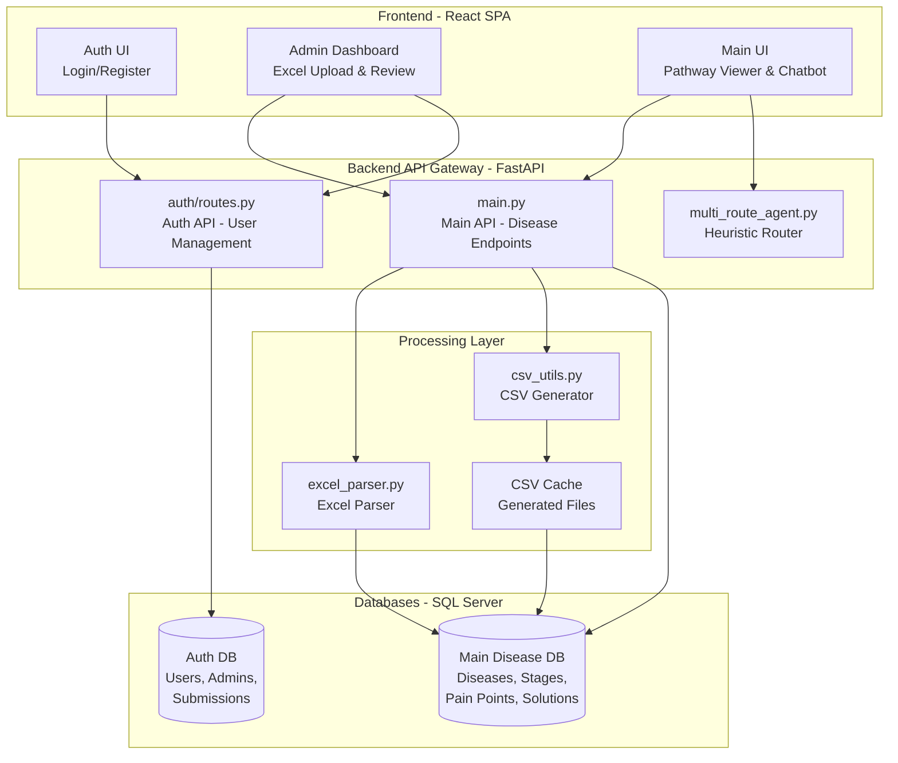
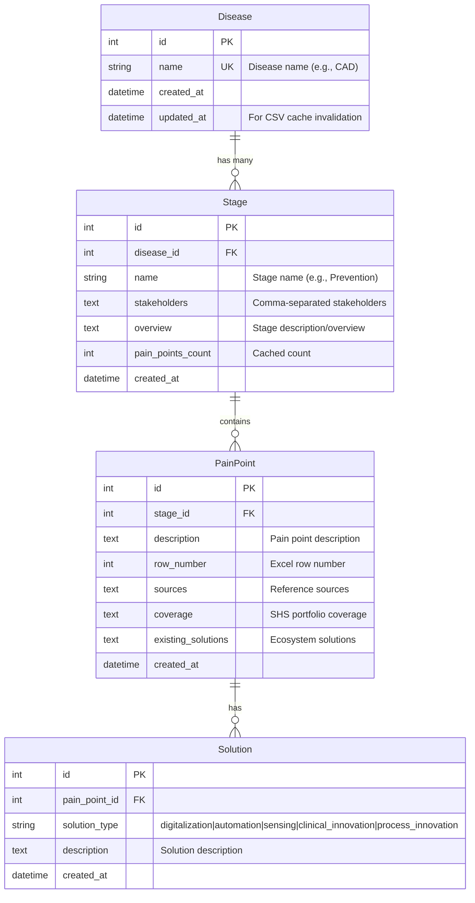
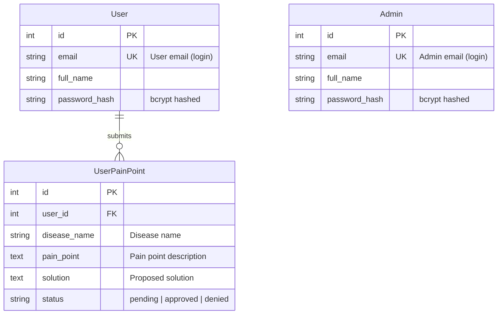
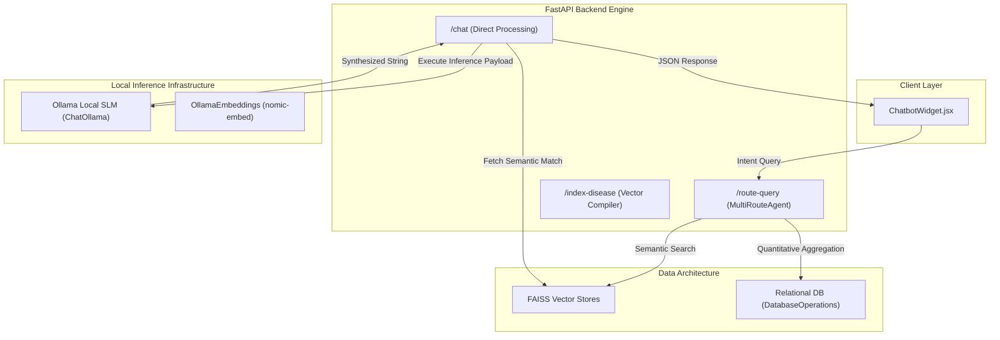
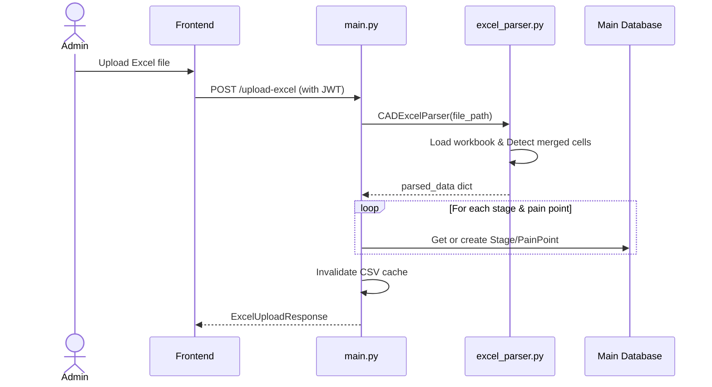
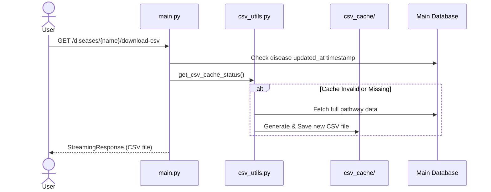

# Disease Pathway - Full End-to-End Documentation

## 1. Executive Summary
The Disease Pathway project is a comprehensive full-stack web application designed to manage, analyze, and visualize structured disease pathway data. It processes hierarchical data from Excel imports, parses complex cell structures, and persists this information into a queryable relational database. The platform is designed with FAANG-grade system architecture, focusing on observability, modern frontend best practices, and robust error handling.

**Key Features:**
- **Hierarchical Pathway Management:** Supports multi-stage data organization (Prevention, Diagnosis, Treatment, Recovery) including associated pain points and categorized solutions.
- **Admin Excel Processing:** Intelligent Excel parser capable of handling merged cells and complex formatting.
- **Dual Database Pattern:** Enhances security by isolating domain data (Main DB) from user/auth data (Auth DB).
- **RAG Chatbot Assistant:** FAISS-based semantic search and local LLM (Ollama) integration for querying pathway data.
- **User Engagement:** Authenticated interface for users to submit additional pain points, queued for administrative review.
- **Automated Notifications:** Webhook integrations via Microsoft Teams/Power Automate for administrative workflows.

---

## 2. Technology Stack
### 2.1 Backend
- **Language:** Python 3.14
- **Framework:** FastAPI (Async REST API)
- **Data Validation:** Pydantic
- **Data Processing:** openpyxl (Excel parsing), pandas (CSV generation)
- **Database:** Microsoft SQL Server (Azure) with SQLAlchemy ORM
- **Authentication:** JWT (OAuth2 Bearer) with bcrypt hashing
- **Server:** Uvicorn (ASGI)

### 2.2 Frontend
- **Framework:** React 18.3
- **Routing:** React Router 7
- **Build Tool:** Vite 5 (HMR enabled)
- **Styling & Animations:** Custom CSS, Framer Motion, Lucide React

### 2.3 LLM & RAG Infrastructure
- **LLM Engine:** Ollama (`ChatOllama`)
- **Embeddings:** `OllamaEmbeddings` (nomic-embed)
- **Vector Database:** FAISS

---

## 3. System Architecture
The application leverages a robust modular architecture that clearly separates concerns between presentation, API processing, data storage, and AI inference.

### 3.1 High-Level Architecture Diagram

---

## 4. Dual Database Pattern Schema

### 4.1 Main Disease Database
This 4-tier relational model captures the full structure of disease pathways.

### 4.2 Authentication & User Activity Database
Isolates user roles (Admin vs User) and handles community submissions.

---

## 5. RAG Chatbot Architecture
The AI integration utilizes a heuristic router (`MultiRouteAgent`) to determine if a query should search the FAISS vector database (semantic), execute a SQL aggregation, or trigger a full CSV payload export.

---

## 6. Key Workflows

### 6.1 Admin Excel Upload and Processing
An incremental update strategy that parses nested merged cells.

### 6.2 Smart CSV Download with Caching
To prevent generation bottlenecks on large datasets, CSV caching validates against `updated_at`.

---

## 7. Frontend Integration & UI/UX
- **Custom Hooks (`useDiseases.js`, `useAuth.js`):** Extracted complex data-fetching logic out of UI components, separating state management from the presentation layer.
- **Global Error Boundaries:** Integrated at the root React application layer to gracefully catch rendering errors.
- **Responsive Navigation:** Admin panel components use flexbox and grid layouts (`.admin-layout`, `.admin-sidebar`) to adapt seamlessly from desktop to tablet/mobile interfaces.

---
*Generated Documentation for Disease Pathway v2*
