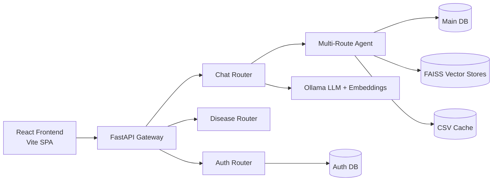
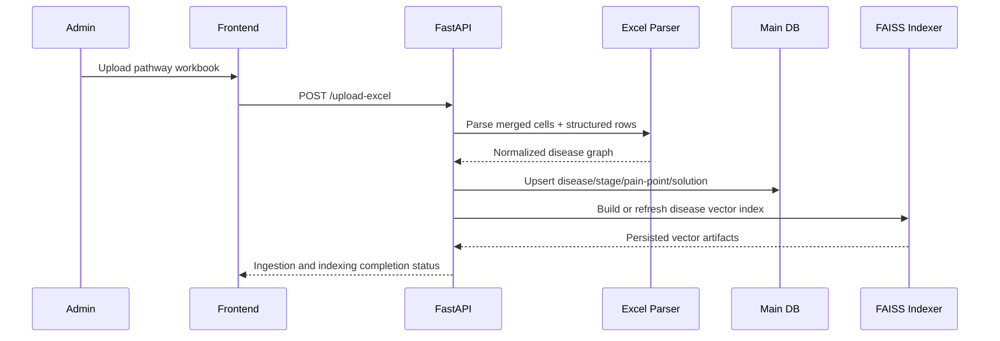
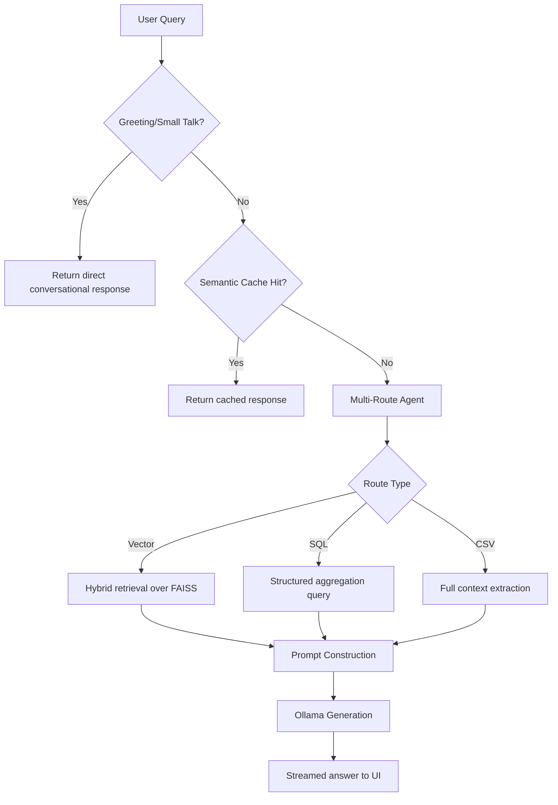
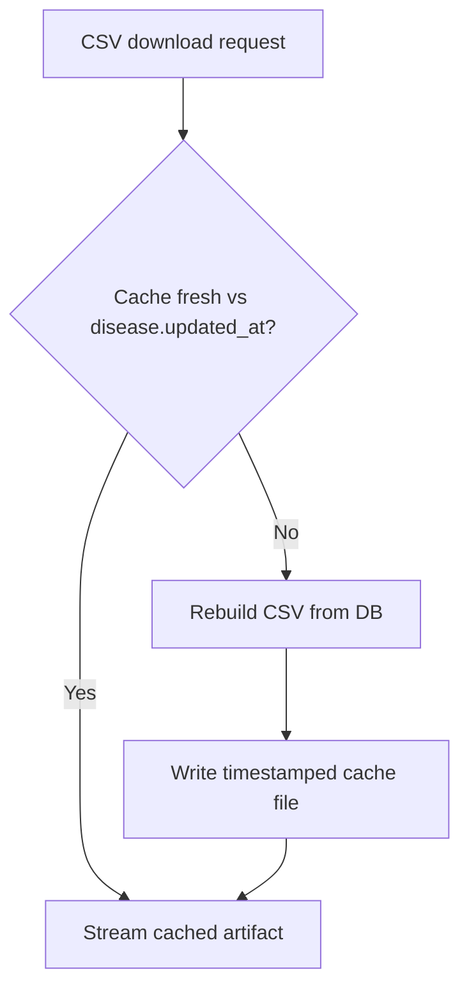

# Disease Pathway Platform

A research-oriented, enterprise-grade platform for disease pathway digitization, clinical pain-point intelligence, and retrieval-augmented AI assistance.

## Abstract

Disease Pathway Platform transforms semi-structured clinical pathway assets into a queryable, auditable, and scalable knowledge system. The platform combines deterministic data engineering (Excel ingestion, relational normalization, dual-database access controls) with retrieval-augmented generation (RAG), semantic caching, and interactive analytics to support decision-making across product, clinical operations, and innovation teams.

## Repository Goals

| Goal | Description | Why It Matters |
| :--- | :--- | :--- |
| Clinical Knowledge Structuring | Normalize complex stage/pain-point/solution data into durable schemas | Enables repeatable analytics and governance |
| AI-Assisted Exploration | Provide contextual answers grounded in pathway evidence | Accelerates insight discovery while reducing hallucination risk |
| Enterprise Readiness | Add operational controls (auth, workflows, observability, CI) | Supports real-world deployment and scale |
| Reproducible Engineering | Standardize setup, data flow, and evaluation surfaces | Improves collaboration and maintainability |

## What Was Implemented (High-Level)

| Workstream | Previous State | Implemented Improvement | Expected Impact |
| :--- | :--- | :--- | :--- |
| Chat API Ownership | Competing `/chat` flows could create inconsistent behavior | Unified effective chat path under `routers/chat.py` and removed conflicting legacy path in `main.py` | Stable chatbot behavior and cleaner endpoint semantics |
| AI Retrieval | Basic query handling with weaker route specialization | Multi-route orchestration across Vector/SQL/CSV pathways | Better response relevance for mixed query intents |
| Performance | Repeated queries incurred repeated generation cost | Semantic caching + FAISS-backed retrieval | Lower median response time on repeated/near-duplicate questions |
| Frontend Discovery | Limited cross-page discoverability | Global search and interactive pathway views | Faster user navigation and data access |
| Reliability | Partial graceful fallback behavior | Explicit no-context responses, cache fallback behavior, operational startup fixes | Improved resilience under degraded dependencies |
| Documentation | Fragmented architecture explanations | Research-grade architecture, workflows, KPI framework, references | Faster onboarding and design clarity |

## System Architecture



## Architectural Workflows

### 1) Ingestion and Indexing Workflow



### 2) Chat Research Workflow (RAG + Routing)



### 3) Export and Cache Workflow



## Data and Domain Model

| Entity | Core Fields | Role in Research Pipeline |
| :--- | :--- | :--- |
| Disease | name, group, updated_at | Top-level pathway anchor and cache invalidation signal |
| Stage | name, stakeholders, overview | Clinical journey segmentation |
| PainPoint | description, source, coverage, existing_solutions | Evidence unit for challenge analysis |
| Solution | type, description | Intervention mapping and opportunity analytics |
| UserPainPoint | user submission + status workflow | Community/field intelligence feedback loop |

## Research Metrics and KPI Framework

The following metrics are designed to evaluate system quality and operational maturity.

| Metric Group | KPI | Definition | Target Direction |
| :--- | :--- | :--- | :--- |
| Retrieval Quality | Context Precision@k | Fraction of retrieved chunks relevant to query intent | Higher |
| Retrieval Quality | Coverage Recall | Fraction of relevant pathway facts surfaced in retrieval | Higher |
| Generation Quality | Faithfulness | Degree to which response is grounded in retrieved evidence | Higher |
| Latency | Chat p50 / p95 | End-to-end response time for chat requests | Lower |
| Latency | Cache Hit Ratio | Share of served responses from semantic cache | Higher |
| Reliability | Error Rate (5xx) | Server failures per 1k requests | Lower |
| Reliability | Fallback Success Rate | Successful degraded responses during dependency issues | Higher |
| Data Ops | Ingestion Success Rate | Successful file ingest jobs / total jobs | Higher |

## Improvements and Novelty

### Novel Contributions in This Implementation

| Novelty Area | Description | Practical Value |
| :--- | :--- | :--- |
| Multi-Route Clinical Querying | Route selection across vector, SQL, and full-context extraction modes | Better fit between query intent and retrieval strategy |
| Semantic Cache Front-Running | Similar queries answered via embedding-similarity cache before generation | Reduced repeated model cost and latency |
| Dual Database Security Boundary | Auth and domain data separated by design | Better governance and lower blast radius |
| Streamed Chat UX | Progressive token rendering in UI | Improved perceived responsiveness and interaction quality |
| Ingestion-to-Index Pipeline | Structured ingest tightly coupled with vector index refresh | Faster pathway availability after updates |

## Enterprise and Production Readiness Matrix

| Capability | Status | Notes |
| :--- | :--- | :--- |
| API Auth (JWT) | Implemented | User/admin boundaries available |
| Role-Governed Workflows | Implemented | Admin moderation endpoints present |
| Observability Hooks | Partial | Structured logging present; full tracing dashboards can be expanded |
| CI/CD Workflow | Implemented | GitHub Actions workflow included |
| Containerization | Implemented | Dockerfile + compose present |
| Disaster Recovery Policy | Planned | Backup/restore runbook should be formalized |
| SLO/Error Budget Policy | Planned | Define and monitor p95 latency + 5xx thresholds |

## Technology Stack

| Layer | Technologies |
| :--- | :--- |
| Backend | Python 3.13+, FastAPI, SQLAlchemy, Pydantic, Uvicorn |
| AI/RAG | LangChain, Ollama (`llama3`, `nomic-embed-text`), FAISS |
| Frontend | React 18, Vite, React Router, Framer Motion, Axios |
| Data | SQLite local mode with optional SQL Server/Azure SQL support |
| Quality | Cypress E2E, pytest, GitHub Actions |

## Setup and Reproducibility

### Prerequisites

- Python 3.13+
- Node.js 18.x or 20.x
- Ollama runtime

```bash
ollama pull llama3
ollama pull nomic-embed-text
```

### Backend

```powershell
cd "Digitization-of-Disease-Pathways-main (1)"
python -m venv .venv
.\.venv\Scripts\Activate.ps1
pip install -r requirements.txt
pip install faiss-cpu
python -m uvicorn main:app --host 127.0.0.1 --port 8000 --reload
```

- API Docs: http://127.0.0.1:8000/docs
- Health: http://127.0.0.1:8000/health

### Frontend

```powershell
cd "Digitization-of-Disease-Pathways-main (1)\frontend\disease-pathways"
npm install
npm run dev
```

- App: http://127.0.0.1:3000 (or 3001 if 3000 is occupied)

## Evaluation and Reporting Template

Use this template to report periodic system quality.

| Period | Dataset Version | Retrieval Precision@k | Faithfulness | Chat p95 | Cache Hit Ratio | Notes |
| :--- | :--- | :--- | :--- | :--- | :--- | :--- |
| YYYY-MM | vX.Y | TBD | TBD | TBD | TBD | Fill after benchmark run |

## Known Limitations

- Vector-store availability and coverage depend on ingestion completeness.
- Current memory store is process-local; distributed session memory is not yet enabled.
- Full observability stack (trace backend, alerting dashboards, SLO burn alerts) is not yet fully wired.

## Research and Engineering Roadmap

- Move heavy ingestion/evaluation jobs to async worker queues.
- Add continuous RAG evaluation in CI with regression thresholds.
- Introduce tenant-aware policy and role scopes for enterprise environments.
- Add automated benchmarking reports (latency, quality, and cost profiles).

## References

1. Lewis et al., Retrieval-Augmented Generation for Knowledge-Intensive NLP Tasks, NeurIPS 2020.
2. Johnson et al., Billion-scale similarity search with GPUs (FAISS), IEEE Transactions on Big Data.
3. FastAPI Documentation, https://fastapi.tiangolo.com/
4. LangChain Documentation, https://python.langchain.com/
5. OWASP ASVS, Application Security Verification Standard, https://owasp.org/www-project-application-security-verification-standard/
6. Google SRE Workbook, Service Level Objectives and Error Budgets, https://sre.google/workbook/
