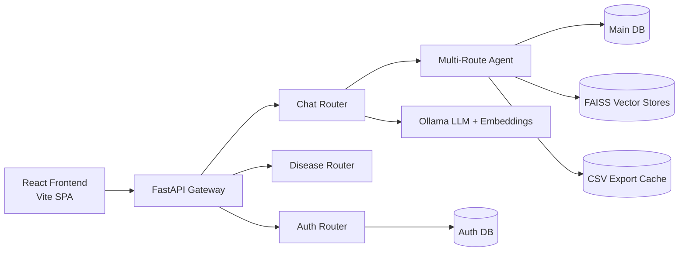
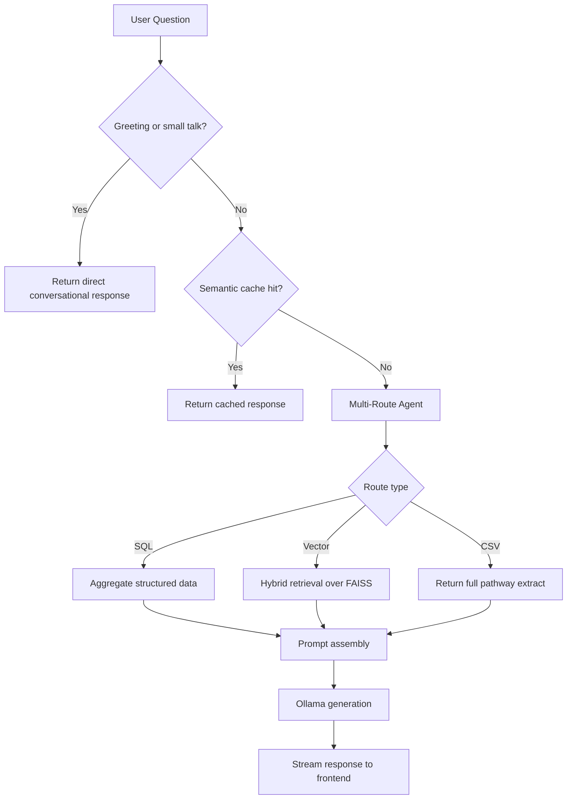
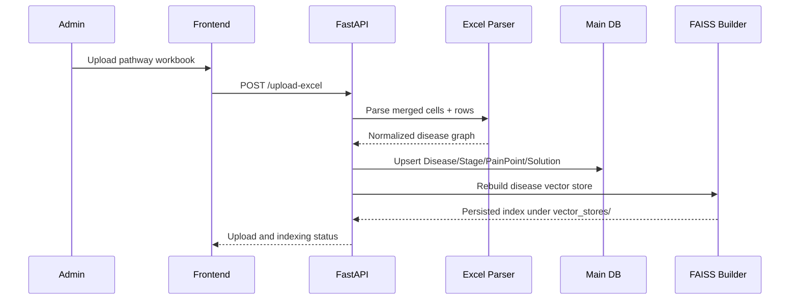
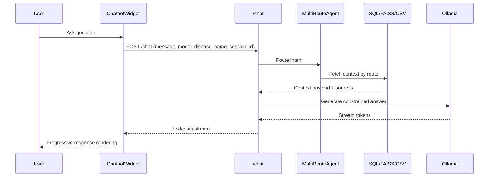
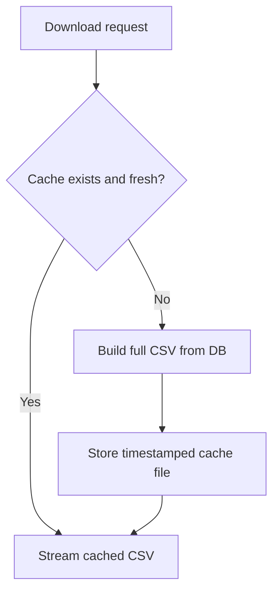
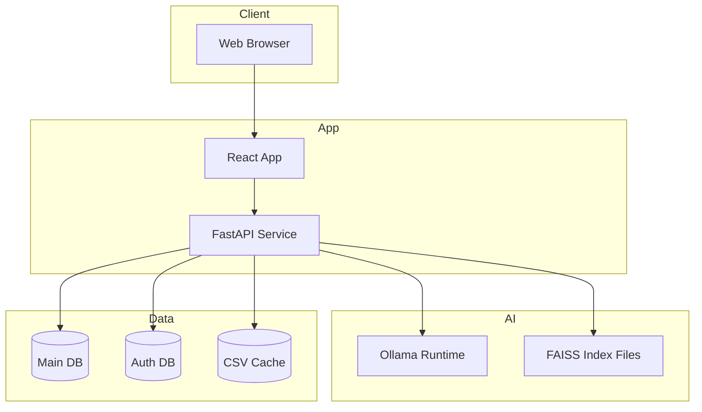

# Disease Pathway Platform

A production-grade platform for digitizing disease pathways, enriching them with AI-assisted retrieval, and supporting enterprise governance workflows.

## High-Level Simple Overview

This release upgraded the application from a single-app prototype into an enterprise-ready architecture:

- Split core backend responsibilities into modular routers for auth, diseases, and chat.
- Unified chatbot behavior under one reliable `/chat` flow with streaming responses.
- Added semantic caching and FAISS-based retrieval for faster repeated questions.
- Strengthened frontend usability with global search, live metrics, and resilient UI components.
- Improved operational readiness with CI workflows, Docker assets, health endpoints, and test coverage.

## FAANG-Relevant System Design Principles Applied

- Reliability first: fallback paths (in-memory caching if Redis unavailable, graceful no-context responses).
- Modular ownership boundaries: API router separation with dedicated auth and disease domains.
- Performance by design: vector retrieval + semantic cache + incremental CSV caching.
- Observability and operations: structured logs, health endpoints, and deployment configs.
- Scalable evolution path: clear migration from monolith-style handlers to service/router split.

## Architecture At a Glance



## Research and Retrieval Workflow

This workflow shows how a user query is routed for the best answer source.



## Architectural Workflows

### 1) Excel Ingestion and Indexing



### 2) Chat Request Lifecycle



### 3) CSV Export with Smart Cache



## Current System Design Improvements in This Repo

- Chat reliability fix: removed legacy conflicting `/chat` implementation from `main.py` so `routers/chat.py` owns chat behavior.
- Optional-context chat behavior: greetings and non-disease queries now handled safely by router logic.
- Faster retrieval setup: `faiss-cpu` support validated with local vector index loading.
- Startup consistency: backend and frontend runbook aligned for local and container workflows.
- Documentation alignment: single source of truth for architecture, workflows, and operational setup.

## Component and Service Boundaries

| Boundary | Primary Files | Responsibility |
| :--- | :--- | :--- |
| API Entry | `main.py` | App wiring, middleware, router registration |
| Auth Domain | `auth/routes.py`, `auth/models.py` | Registration, login, admin and user controls |
| Disease Domain | `routers/diseases_router.py`, `database.py` | Pathway retrieval, stats, export-oriented data |
| AI Domain | `routers/chat.py`, `multi_route_agent.py`, `rag_tools.py` | Route selection, retrieval, generation, streaming |
| Frontend UI | `frontend/disease-pathways/src` | Route views, widgets, search, dashboards |

## Technology Stack

| Layer | Technologies |
| :--- | :--- |
| Backend | Python 3.13+, FastAPI, SQLAlchemy, Pydantic, Uvicorn |
| AI/RAG | LangChain, Ollama (`llama3`, `nomic-embed-text`), FAISS |
| Frontend | React 18, Vite, React Router, Framer Motion, Axios |
| Data | SQLite (local), optional SQL Server/Azure SQL support |
| Quality | Cypress E2E, pytest, GitHub Actions |

## Deployment Topology (Reference)



## Getting Started

### Prerequisites

- Python 3.13+
- Node.js 18.x or 20.x
- Ollama installed and running

```bash
ollama pull llama3
ollama pull nomic-embed-text
```

### Backend

```powershell
cd "Digitization-of-Disease-Pathways-main (1)"
python -m venv .venv
.\.venv\Scripts\Activate.ps1
pip install -r requirements.txt
pip install faiss-cpu
python -m uvicorn main:app --host 127.0.0.1 --port 8000 --reload
```

- Docs: http://127.0.0.1:8000/docs
- Health: http://127.0.0.1:8000/health

### Frontend

```powershell
cd "Digitization-of-Disease-Pathways-main (1)\frontend\disease-pathways"
npm install
npm run dev
```

- App: http://127.0.0.1:3000 (or 3001 if 3000 is occupied)

## Design Roadmap (Next Enterprise Steps)

- Move heavy indexing/evaluation tasks to worker queues (Celery/Redis).
- Add strict request SLOs and p95 dashboards for chat and search routes.
- Introduce per-tenant policy controls and scoped model access.
- Add policy-driven redaction and audit trails for regulated environments.
