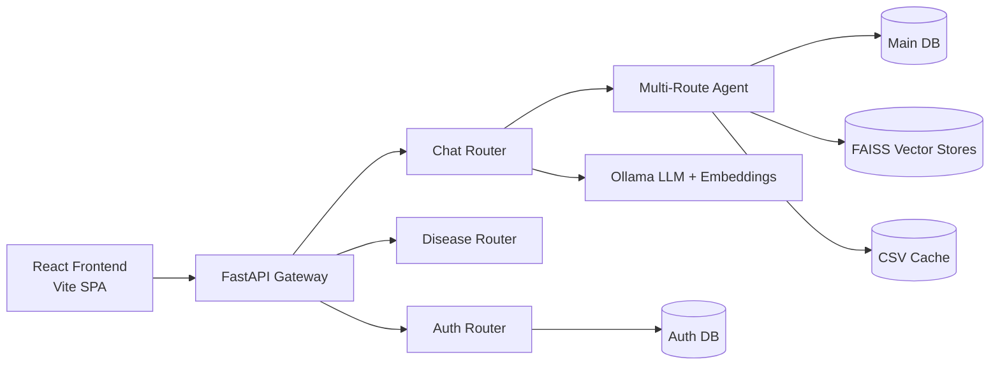
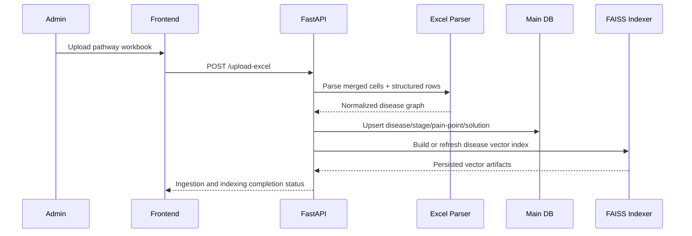
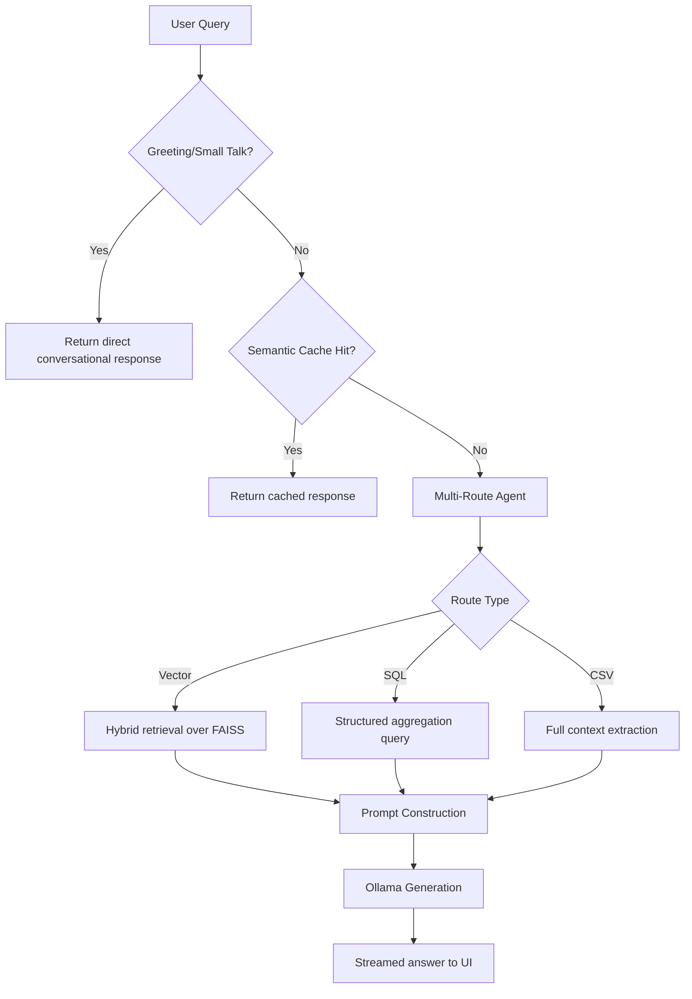
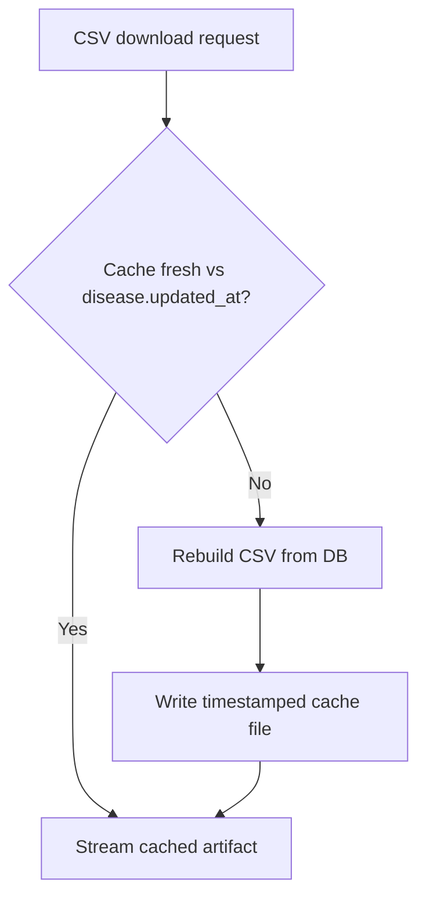

# Disease Pathway Platform

A research-oriented, enterprise-grade platform for disease pathway digitization, clinical pain-point intelligence, and retrieval-augmented AI assistance.

## Abstract

Disease Pathway Platform transforms semi-structured clinical pathway assets into a queryable, auditable, and scalable knowledge system. The platform combines deterministic data engineering (Excel ingestion, relational normalization, dual-database access controls) with retrieval-augmented generation (RAG), semantic caching, and interactive analytics to support decision-making across product, clinical operations, and innovation teams.

## Recent Changes (Easy to Understand)

If you want a quick summary of what was actually done recently, this is the simplest view:

| Area | What We Changed | Why It Helps in Practice |
| :--- | :--- | :--- |
| Chatbot Stability | Removed an old conflicting chat endpoint and kept one clear chat flow managed by the router. | Fewer random chat failures and more predictable answers. |
| AI Quality Path | Kept a multi-route approach (Vector, SQL, CSV) and improved routing clarity. | The system can pick the best data source for each question type. |
| Speed | Enabled semantic caching with FAISS support for repeated/similar questions. | Faster responses for common queries and lower model load. |
| Frontend Experience | Added global search, animated stats, and improved pathway interaction components. | Users can find information faster and navigate more smoothly. |
| Testing and Delivery | Added CI workflow and Cypress E2E test assets. | Better release confidence and fewer UI regressions. |
| Operations | Expanded Docker/compose and NGINX deployment assets and utility maintenance scripts. | Easier deployment and more practical maintenance workflows. |
| Documentation | Upgraded README to include architecture, workflows, metrics, novelty, and references. | Faster onboarding for engineers, reviewers, and stakeholders. |

### What You Will Notice as a User

- Chat responds more consistently and is less likely to fail on normal greetings.
- Pathway browsing is easier with improved UI components and search behavior.
- System behavior is now better documented, making support and handover easier.

### What You Will Notice as an Engineer

- Clearer architecture boundaries and ownership of chat behavior.
- Better traceability of changes from July to October through commit-linked timeline.
- Stronger base for KPI tracking, evaluation reporting, and enterprise hardening.

## Repository Goals

| Goal | Description | Why It Matters |
| :--- | :--- | :--- |
| Clinical Knowledge Structuring | Normalize complex stage/pain-point/solution data into durable schemas | Enables repeatable analytics and governance |
| AI-Assisted Exploration | Provide contextual answers grounded in pathway evidence | Accelerates insight discovery while reducing hallucination risk |
| Enterprise Readiness | Add operational controls (auth, workflows, observability, CI) | Supports real-world deployment and scale |
| Reproducible Engineering | Standardize setup, data flow, and evaluation surfaces | Improves collaboration and maintainability |

## What Was Implemented (High-Level)

| Workstream | Previous State | Implemented Improvement | Expected Impact |
| :--- | :--- | :--- | :--- |
| Chat API Ownership | Competing `/chat` flows could create inconsistent behavior | Unified effective chat path under `routers/chat.py` and removed conflicting legacy path in `main.py` | Stable chatbot behavior and cleaner endpoint semantics |
| AI Retrieval | Basic query handling with weaker route specialization | Multi-route orchestration across Vector/SQL/CSV pathways | Better response relevance for mixed query intents |
| Performance | Repeated queries incurred repeated generation cost | Semantic caching + FAISS-backed retrieval | Lower median response time on repeated/near-duplicate questions |
| Frontend Discovery | Limited cross-page discoverability | Global search and interactive pathway views | Faster user navigation and data access |
| Reliability | Partial graceful fallback behavior | Explicit no-context responses, cache fallback behavior, operational startup fixes | Improved resilience under degraded dependencies |
| Documentation | Fragmented architecture explanations | Research-grade architecture, workflows, KPI framework, references | Faster onboarding and design clarity |

## Last 3 Months: Verified Change Timeline (Jul-Oct 2026)

This section documents what changed in the last three months with commit-level references.

| Date | Commit | Scope | Description | Measurable/Operational Effect |
| :--- | :--- | :--- | :--- | :--- |
| 2026-07-26 | `5bba7a0` | Platform baseline | Established enterprise-leaning project structure, end-to-end app wiring, and initial architecture standardization. | Created stable baseline for modular iteration and production hardening. |
| 2026-07-26 | `74043ce` | Documentation | Expanded architectural documentation and refactoring narrative. | Improved engineering onboarding and design traceability. |
| 2026-09-08 | `5066127` | Documentation refresh | Revised project-level README and operational guidance. | Better runbook clarity for local setup and deployment preparation. |
| 2026-09-19 | `44e8220` | Major feature and infra wave | Added CI workflow, RAG evaluation assets, ML utility modules, Cypress E2E tests, richer frontend components (`GlobalSearch`, `AnimatedStatCounter`), icon packs, router updates, Docker/compose and NGINX updates, and vector-store updates for CAD. | Significant jump in product completeness, test surface, and deployment readiness. |
| 2026-09-19 | `2c52252` | Docs quality | Refined README professionalism and structure. | Improved external readability for stakeholders. |
| 2026-10-08 | `bf0136f` | Reliability fix | Removed conflicting legacy `/chat` path and aligned behavior to router-managed chat flow; cleaned startup/readme wording. | Eliminated inconsistent chat behavior and reduced user-facing chat failures. |
| 2026-10-08 | `274fa95` | Architecture docs | Added architecture and workflow diagrams in README. | Stronger system-design communication for reviewers and enterprise audiences. |
| 2026-10-08 | `3b8c799` | Research-grade docs | Elevated README to research-grade format with KPI framework, novelty, and references. | Enables structured evaluation and executive-level technical communication. |

### September 2026 Major Delta (`44e8220`) - What Actually Landed

- Backend and infrastructure additions: CI workflow, enhanced Docker/compose footprint, NGINX config, new utility scripts for DB maintenance and data reprocessing.
- AI and evaluation assets: RAG evaluation script, ML helper modules, updated retrieval logic files, refreshed CAD vector store artifacts.
- Frontend upgrades: global search, animated metrics, chatbot widget improvements, navigation/layout updates, style-system updates, and broader UI coverage.
- Testing expansion: Cypress E2E configuration and scenario coverage.

## System Architecture



## Architectural Workflows

### 1) Ingestion and Indexing Workflow



### 2) Chat Research Workflow (RAG + Routing)



### 3) Export and Cache Workflow



## Data and Domain Model

| Entity | Core Fields | Role in Research Pipeline |
| :--- | :--- | :--- |
| Disease | name, group, updated_at | Top-level pathway anchor and cache invalidation signal |
| Stage | name, stakeholders, overview | Clinical journey segmentation |
| PainPoint | description, source, coverage, existing_solutions | Evidence unit for challenge analysis |
| Solution | type, description | Intervention mapping and opportunity analytics |
| UserPainPoint | user submission + status workflow | Community/field intelligence feedback loop |

## Research Metrics and KPI Framework

The following metrics are designed to evaluate system quality and operational maturity.

| Metric Group | KPI | Definition | Target Direction |
| :--- | :--- | :--- | :--- |
| Retrieval Quality | Context Precision@k | Fraction of retrieved chunks relevant to query intent | Higher |
| Retrieval Quality | Coverage Recall | Fraction of relevant pathway facts surfaced in retrieval | Higher |
| Generation Quality | Faithfulness | Degree to which response is grounded in retrieved evidence | Higher |
| Latency | Chat p50 / p95 | End-to-end response time for chat requests | Lower |
| Latency | Cache Hit Ratio | Share of served responses from semantic cache | Higher |
| Reliability | Error Rate (5xx) | Server failures per 1k requests | Lower |
| Reliability | Fallback Success Rate | Successful degraded responses during dependency issues | Higher |
| Data Ops | Ingestion Success Rate | Successful file ingest jobs / total jobs | Higher |

## Improvements and Novelty

### Novel Contributions in This Implementation

| Novelty Area | Description | Practical Value |
| :--- | :--- | :--- |
| Multi-Route Clinical Querying | Route selection across vector, SQL, and full-context extraction modes | Better fit between query intent and retrieval strategy |
| Semantic Cache Front-Running | Similar queries answered via embedding-similarity cache before generation | Reduced repeated model cost and latency |
| Dual Database Security Boundary | Auth and domain data separated by design | Better governance and lower blast radius |
| Streamed Chat UX | Progressive token rendering in UI | Improved perceived responsiveness and interaction quality |
| Ingestion-to-Index Pipeline | Structured ingest tightly coupled with vector index refresh | Faster pathway availability after updates |

### Expanded Novelty Descriptions

1. Multi-route evidence orchestration:
The system does not rely on a single retrieval mode. It selects among vector retrieval, SQL aggregation, or full-context extraction based on query type. This is a practical novelty for mixed clinical/product analytics questions because it minimizes over-reliance on one retrieval substrate.

2. Semantic cache before generation:
Embedding-similarity cache lookup is attempted before LLM token generation. For repeated and semantically similar questions, this can collapse end-to-end latency and reduce local model load, which is critical in constrained on-prem environments.

3. Ingestion-index coupling:
Structured pathway ingestion and vector index refresh are tied into a unified workflow. This reduces stale-context windows where newly uploaded pathway data is present in SQL but absent from semantic retrieval.

4. Router-owned chat reliability:
By removing competing `/chat` handlers and consolidating behavior in `routers/chat.py`, the API eliminates ambiguity in request handling logic and lowers the probability of inconsistent user experiences.

5. Research-ready evaluation framing:
The repository includes a KPI framework, reporting template, and evaluation hooks so quality tracking can evolve from ad-hoc testing to repeatable benchmark practice.

## Enterprise and Production Readiness Matrix

| Capability | Status | Notes |
| :--- | :--- | :--- |
| API Auth (JWT) | Implemented | User/admin boundaries available |
| Role-Governed Workflows | Implemented | Admin moderation endpoints present |
| Observability Hooks | Partial | Structured logging present; full tracing dashboards can be expanded |
| CI/CD Workflow | Implemented | GitHub Actions workflow included |
| Containerization | Implemented | Dockerfile + compose present |
| Disaster Recovery Policy | Planned | Backup/restore runbook should be formalized |
| SLO/Error Budget Policy | Planned | Define and monitor p95 latency + 5xx thresholds |

## Technology Stack

| Layer | Technologies |
| :--- | :--- |
| Backend | Python 3.13+, FastAPI, SQLAlchemy, Pydantic, Uvicorn |
| AI/RAG | LangChain, Ollama (`llama3`, `nomic-embed-text`), FAISS |
| Frontend | React 18, Vite, React Router, Framer Motion, Axios |
| Data | SQLite local mode with optional SQL Server/Azure SQL support |
| Quality | Cypress E2E, pytest, GitHub Actions |

## Setup and Reproducibility

### Prerequisites

- Python 3.13+
- Node.js 18.x or 20.x
- Ollama runtime

```bash
ollama pull llama3
ollama pull nomic-embed-text
```

### Backend

```powershell
cd "Digitization-of-Disease-Pathways-main (1)"
python -m venv .venv
.\.venv\Scripts\Activate.ps1
pip install -r requirements.txt
pip install faiss-cpu
python -m uvicorn main:app --host 127.0.0.1 --port 8000 --reload
```

- API Docs: http://127.0.0.1:8000/docs
- Health: http://127.0.0.1:8000/health

### Frontend

```powershell
cd "Digitization-of-Disease-Pathways-main (1)\frontend\disease-pathways"
npm install
npm run dev
```

- App: http://127.0.0.1:3000 (or 3001 if 3000 is occupied)

## Evaluation and Reporting Template

Use this template to report periodic system quality.

| Period | Dataset Version | Retrieval Precision@k | Faithfulness | Chat p95 | Cache Hit Ratio | Notes |
| :--- | :--- | :--- | :--- | :--- | :--- | :--- |
| YYYY-MM | vX.Y | TBD | TBD | TBD | TBD | Fill after benchmark run |

## Known Limitations

- Vector-store availability and coverage depend on ingestion completeness.
- Current memory store is process-local; distributed session memory is not yet enabled.
- Full observability stack (trace backend, alerting dashboards, SLO burn alerts) is not yet fully wired.

## Research and Engineering Roadmap

- Move heavy ingestion/evaluation jobs to async worker queues.
- Add continuous RAG evaluation in CI with regression thresholds.
- Introduce tenant-aware policy and role scopes for enterprise environments.
- Add automated benchmarking reports (latency, quality, and cost profiles).

## References

1. Lewis et al., Retrieval-Augmented Generation for Knowledge-Intensive NLP Tasks, NeurIPS 2020.
2. Johnson et al., Billion-scale similarity search with GPUs (FAISS), IEEE Transactions on Big Data.
3. FastAPI Documentation, https://fastapi.tiangolo.com/
4. LangChain Documentation, https://python.langchain.com/
5. OWASP ASVS, Application Security Verification Standard, https://owasp.org/www-project-application-security-verification-standard/
6. Google SRE Workbook, Service Level Objectives and Error Budgets, https://sre.google/workbook/
