# Disease Pathway - V2 (FAANG Architecture & UI/UX Upgrades)

## What's New in This Version?
We have heavily refactored the original codebase to align with FAANG-grade system design principles, observability, and frontend best practices. 

### 1. Architectural Modularity (Backend)
- **Separation of Concerns:** Refactored the monolithic `main.py` by extracting route handlers into a modular `routers/` directory (e.g., `diseases_router.py`, `chat.py`). This makes the codebase scalable, easier to test, and ready for microservices.
- **Observability Middleware:** Implemented `CorrelationIdMiddleware` to inject unique trace IDs into every request, allowing for distributed tracing and advanced logging.
- **Standardized Error Handling:** Added a global exception handler middleware that catches unhandled crashes and formats them into **RFC 7807** compliant Problem Details JSON responses.

### 2. Frontend React Architecture
- **Custom Hooks:** Extracted complex data-fetching logic out of UI components and into reusable custom hooks (e.g., `useDiseases.js`). This strictly separates state management from the presentation layer.
- **Global Error Boundaries:** Integrated `ErrorBoundary.jsx` at the root of the React application to gracefully catch rendering errors and prevent full-page crashes (White Screen of Death).

### 3. UI/UX & Responsive Design Overhaul
- **Dashboard Fixes:** Fixed critical export bugs in the Analytics Dashboard that prevented it from rendering on the Admin Panel.
- **Desktop-App Layout:** Replaced brittle inline styles with robust CSS classes (`.admin-layout`, `.admin-sidebar`). Implemented independent scrolling for the sidebar and main content areas, mimicking premium SaaS products.
- **Mobile Responsiveness:** Added proper `@media` queries to ensure the Admin Panel collapses into a smooth, horizontal navigation strip on tablets and mobile devices.

### 4. Version Control Optimization
- **Clean Repository:** Introduced a strict `.gitignore` to exclude `node_modules`, `__pycache__`, and virtual environments, shrinking the repository size and improving CI/CD pipeline efficiency.

---

<details>
<summary><b>Original README (Before Refactoring)</b></summary>

# Disease Pathway
A web application for managing disease pathway data with Excel import and user submission capabilities.
## Overview

Disease Pathway is a full-stack web application that processes structured Excel files containing hierarchical pathway data, parses complex merged-cell formats, and stores the information in a queryable relational database. The system supports multi-stage data organization with associated pain points and categorized solutions. Users can submit additional entries through an authenticated interface, which are queued for administrative review. The platform provides CSV export functionality with intelligent caching and integrates with external notification systems for workflow automation.

### Dual Database Pattern

The application implements a dual database architecture that separates domain data from authentication data. The Main Database stores pathway-related entities (diseases, stages, pain points, solutions), while the Auth Database manages user credentials, permissions, and user-generated submissions. This separation enhances security through data isolation and enables independent scaling of authentication and application data layers.


## Technology Stack
**1.Backend:**
- **Python**: 3.14
- **Framework**: FastAPI (Async REST API)
- **Data Validation**: Pydantic
- **Excel Parsing**: openpyxl
- **Database**: Microsoft SQL Server (Azure)
- **ORM**: SQLAlchemy
- **Authentication**: JWT (OAuth2 Bearer)
- **Password Security**: bcrypt hashing
- **Notifications**: Power Automate Webhook (Microsoft Teams Adaptive Cards)
- **Server**: uvicorn (ASGI)
- **ODBC Driver** 17 or 18 for SQL Server

**2.Frontend:**
- **React**: 18.3 (with concurrent features)
- **Routing**: React Router 7
- **Build Tool**: Vite 5 (with HMR)
- **State Management**: Context API
- **HTTP Client**: axios
- **Styling**: Custom CSS
- **Animations**: Framer Motion
- **Icons**: Lucide React


# File Structure
```tree

Disease path way/Disease Pathway/
|
├─ admins.json 
├── auth/
│   ├── database.py
│   ├── dependencies.py
│   ├── init.py
│   ├── mail.py
│   ├── models.py
│   ├── routes.py
│   ├── utils.py
│   
├── create_admin.py
├─ csv_cache
├── csv_utils.py
├── database.py
├─ disease_pathway.db (ignored)
├── Dockerfile
├── excel_parser.py
├── frontend/
│   └── disease-pathways/
│       ├── .gitignore
│       |
│       ├── eslint.config.js
│       ├── index.html
│       ├─ node_modules
│       ├── package-lock.json
│       ├── package.json
│       ├── public/
│       │   ├── DP.png
│       │   ├── faviconV2.png
│       │   ├── hero2.png
│       │   ├── hero3.png
│       │   ├── hero4.png
│       │   ├── logo.png
│       │   └── Stakeholders/
│       │       ├── Cardiac Surgeons.png
│       │       ├── Cardiologists.png
│       │       ├── Community organizations.png
│       │       ├── Dietitionist.png
│       │       ├── Digital Health Platforms.png
│       │       ├── Emergency Physicians.png
│       │       ├── FamilyCaregivers.png
│       │       ├── Food and technology companies.png
│       │       ├── General Practitioners.png
│       │       ├── GeneralPractitioner.png
│       │       ├── Government health agencies.png
│       │       ├── Interventional Cardiologists.png
│       │       ├── Lab Specialists.png
│       │       ├── MedTechCompanies.png
│       │       ├── MentalHealthProfessional.png
│       │       ├── Neurologist.png
│       │       ├── NGOs.png
│       │       ├── Nurse.png
│       │       ├── NurseCare.png
│       │       ├── Paramedics.png
│       │       ├── Patients & General Population.png
│       │       ├── Patients.png
│       │       ├── PayersInsurers.png
│       │       ├── Pharma Companies.png
│       │       ├── Primary Care Physicians (GPs).png
│       │       ├── Psychologists.png
│       │       ├── Public Health Authorities.png
│       │       ├── Radiologists.png
│       │       ├── Rehab Specialists Physiotherapists.png
│       │       ├── RehabilitationSpecialist.png
│       │       ├── Society.png
│       │       ├── Technology Providers (SHS, GE, etc.) .png
│       │       └── Technology Providers (wearables, apps).png
│       ├── README.md
│       ├── src/
│       │   ├── App.css
│       │   ├── App.jsx
│       │   ├── assets/
│       │   │   └── react.svg
│       │   ├── components/
│       │   │   ├── ContactUsManagement.jsx
│       │   │   ├── ContactUsModal.jsx
│       │   │   ├── DialogContainer.jsx
│       │   │   ├── DiseaseGrid.jsx
│       │   │   ├── DownloadButton.jsx
│       │   │   ├── FloatingWidget.jsx
│       │   │   ├── Footer.jsx
│       │   │   ├── FormattedText.jsx
│       │   │   ├── LoadingSpinner.jsx
│       │   │   ├── LoadMoreButton.jsx
│       │   │   ├── MinimalNavbar.jsx
│       │   │   ├── Navbar.jsx
│       │   │   ├── PainPointCard.jsx
│       │   │   ├── PainPointDetailModal.jsx
│       │   │   ├── PainPointManagement.jsx
│       │   │   ├── PainPointModal.jsx
│       │   │   ├── PainPointSubmissionModal.jsx
│       │   │   ├── PinterestLayout.jsx
│       │   │   ├── StakeholderCard.jsx
│       │   │   └── StakeholderSection.jsx
│       │   ├── hooks/
│       │   │   └── useAuth.js
│       │   ├── index.css
│       │   ├── main.jsx
│       │   ├── pages/
│       │   │   ├── Admin.jsx
│       │   │   ├── DiseasePathway.jsx
│       │   │   ├── DiseaseSelection.jsx
│       │   │   ├── Home.jsx
│       │   │   └── Login.jsx
│       │   ├── styles/
│       │   │   ├── components.css
│       │   │   └── globals.css
│       │   └── utils/
│       │       ├── animations.js
│       │       ├── api.js
│       │       ├── constants.js
│       │       └── textParser.js
│       └── vite.config.js
├── main.py
├── models.py
├─ pyproject.toml 
├── README.md
├── requirements.txt
├─ uploads

```


# Architecture Pattern
<center>

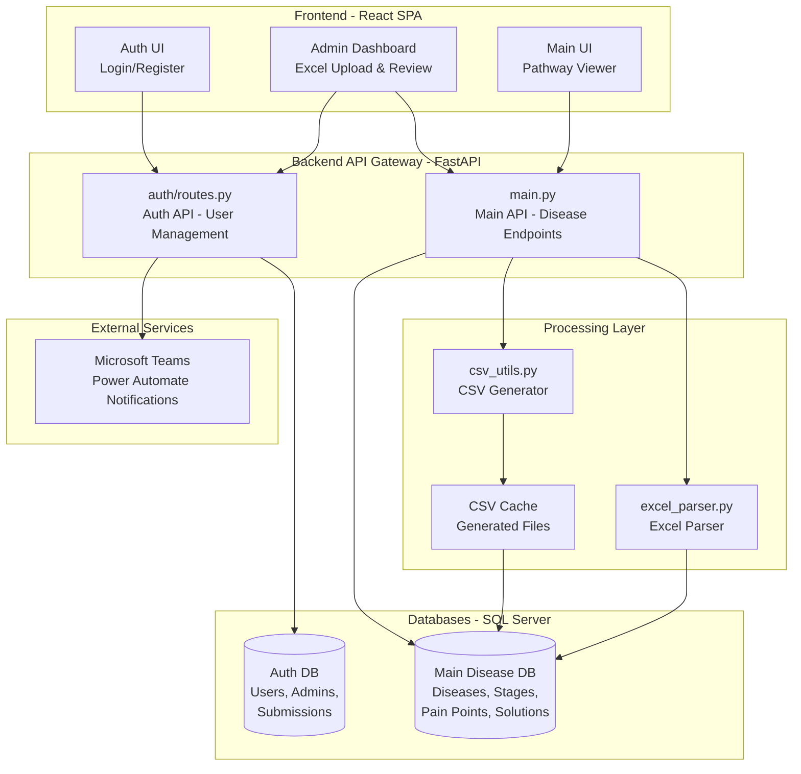
</center>

## Chatbot Architecture

- **Overview:** The project includes a conversational assistant implemented as a React widget and a FastAPI backend. The LLM is driven via Ollama (`ChatOllama`) while embeddings use `OllamaEmbeddings`; semantic retrieval is performed with FAISS vector stores.

- **Routing Agent:** The heuristic router lives in `multi_route_agent.py` as `MultiRouteAgent`. It inspects free-text queries and chooses one of three routes: `vector` (semantic search via FAISS), `sql` (database aggregations via `DatabaseOperations`), or `csv` (full pathway export). The backend endpoint `/route-query` adapts to the chosen route and returns either semantic documents, aggregated solution lists, or the CSV payload.

- **Aggregator / Indexing (FAISS):** The indexing function `index_disease_pathway_to_vector_store` (in `main.py`) converts parsed disease/stage/pain-point data into `Document` objects, splits them with `RecursiveCharacterTextSplitter`, embeds chunks using `OllamaEmbeddings`, and builds a FAISS index with `FAISS.from_documents`. In-memory stores live in the `VECTOR_STORES` dict and persisted stores are saved under `./vector_stores`.

- **Chat flow:** The frontend widget posts to `/chat` with `message`, `model`, `disease_name`, and `session_id`. The backend prepares context by: (a) detecting summary-style queries and pulling a DB-derived context (`get_db_context`), or (b) performing a FAISS similarity search and joining `doc.page_content`. A strict system prompt instructs the LLM to answer only from the provided context. Conversation history is kept in-memory in `MEMORY_STORES` per `session_id` and used to provide limited chat history to the model.

- **Key endpoints:**
    - `POST /chat` — chat with the LLM using disease-specific context
    - `POST /route-query` — agent-based routing: vector / sql / csv
    - `POST /index-disease/{disease_name}` — (re)build FAISS index for a disease
    - `GET /vector-stores` — list available vector stores (memory + persisted)

- **Operational notes:**
    - The frontend sends an `Authorization` header; currently `/chat` performs no server-side auth enforcement by default (this can be added with `Depends(get_current_user_info)`).
    - Indexing is triggered on upload and can be scheduled as a background task; for large datasets, prefer an external worker or queued job to avoid blocking the API process.
    - Tuning knobs: text chunk size / overlap in `RecursiveCharacterTextSplitter`, `k` for `similarity_search`, and `MAX_ROWS` used when building DB summaries.

- **Files to inspect:** `main.py` (chat, indexing, context helpers), `multi_route_agent.py` (routing heuristics), `frontend/disease-pathways/src/components/ChatbotWidget.jsx` (UI + request flow), and `vector_stores/` (persisted indexes).

**Chatbot Structure (Mermaid)**

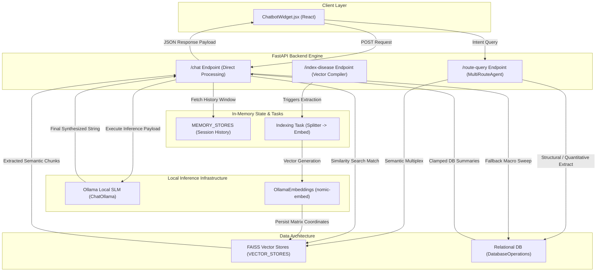


## Dual Database Pattern
The application uses a **Dual Database Pattern** that separates:
- **Main Disease DB**: Stores all disease-related information
- **Auth DB**: Manages user credentials and permissions

**Benefits:**
- Enhanced security through data isolation
- Independent scaling and maintenance
- Clear separation between application domains


## Database Schema

Main Disease Database Schema
The Main Disease Database implements a hierarchical four-tier relational model designed to capture the complete structure of disease pathways. At the top level, the Disease entity serves as the root container, storing disease identifiers and timestamp metadata including an updated_at field that drives the CSV cache invalidation mechanism. Each disease encompasses multiple Stage entities (such as Prevention, Diagnosis, Treatment, and Recovery), where stages contain descriptive overviews, comma-separated stakeholder lists, and a denormalized pain_points_count for query optimization. Within each stage, PainPoint entities represent specific challenges or issues in the care pathway, enriched with contextual metadata including Excel row numbers for traceability, reference sources for evidence-based documentation, SHS portfolio coverage assessments, and existing ecosystem solution mappings. Each pain point further decomposes into multiple Solution entities, categorized by solution type (digitalization, automation, sensing, clinical innovation, or process innovation), forming a comprehensive knowledge base that maps clinical challenges to technological and procedural interventions. This schema design enables efficient querying of pathway data while maintaining referential integrity through cascading foreign key relationships.
<center>

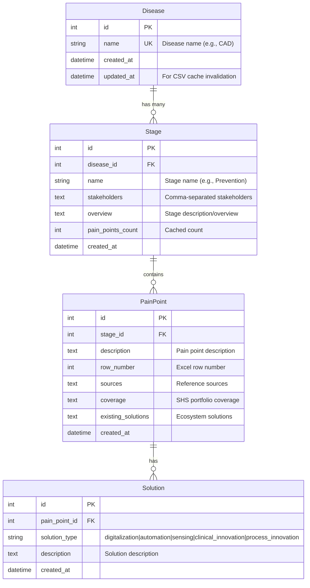
</center>

## Auth Schema
The Authentication Database employs a security-focused dual-table architecture that strictly separates user roles and manages user-generated content through isolated entities. The User and Admin tables maintain completely separate authentication domains, both storing bcrypt-hashed passwords with unique email constraints, preventing privilege escalation attacks and enabling independent access control policies. User-submitted content is managed through the UserPainPoint entity, which creates a many-to-one relationship with the User table and implements a three-state workflow system (pending, approved, denied) for administrative moderation. Each submission captures disease-specific feedback with free-text disease names, detailed pain point descriptions, proposed solutions, and optional source references, all timestamped for audit trail purposes. The ContactUs entity operates independently without foreign key constraints, storing general inquiry data (user name, email, subject, and description) for administrative review. This separation ensures that authentication data, user-generated submissions, and contact inquiries remain in distinct security domains while supporting efficient administrative workflows through clear ownership relationships and status-based filtering capabilities.

<center>

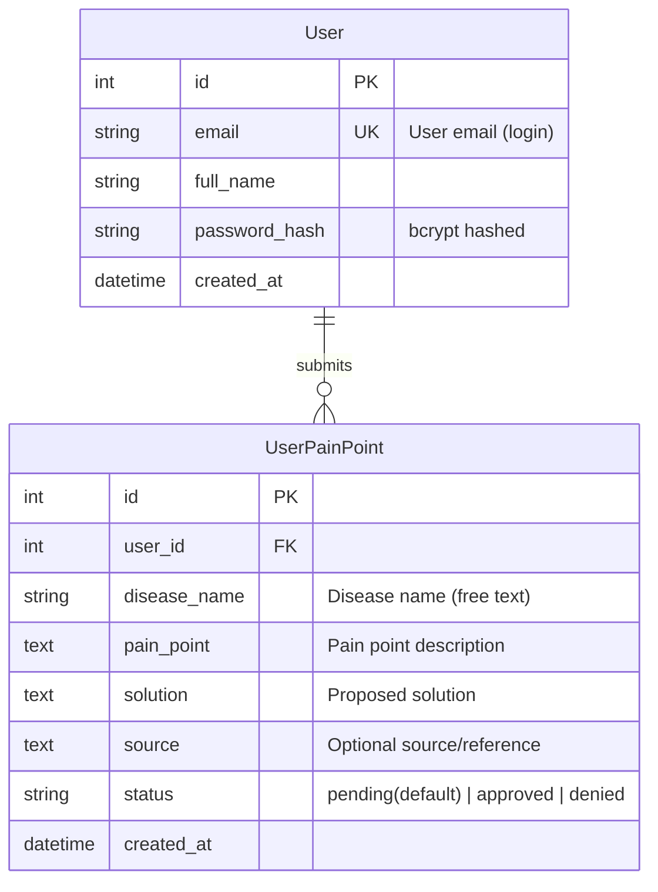
</center>

### Admin Schema
<center>

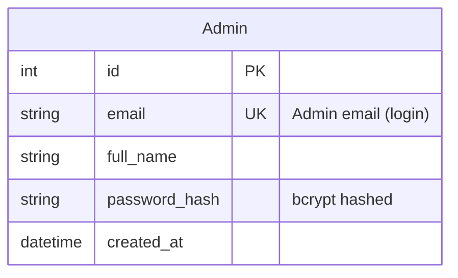
### Contact Us form
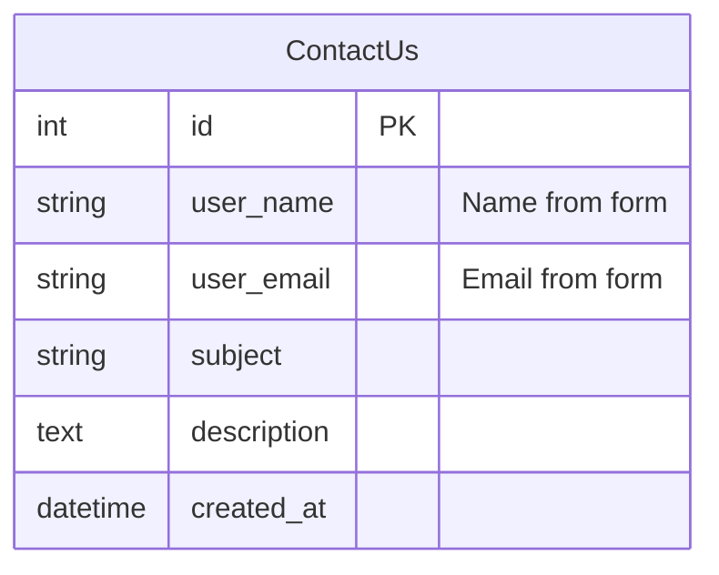

</center>

## Sequence Diagrams
The following sequence diagrams illustrate the core workflows and interactions within the Disease Pathway system. Each diagram shows the step-by-step process flow between actors (users/admins), frontend components, backend services, databases, and external systems.


### User Registration and Login
This workflow demonstrates the complete authentication cycle from initial user registration through login and subsequent access to protected resources. The system implements a secure JWT-based authentication mechanism with bcrypt password hashing, ensuring credentials are never stored in plain text.

#### Key Features:

- Registration: Email validation, duplicate checking, and secure password hashing
- Login: Credential verification with JWT token generation (7-day expiration)
- Protected Access: Token-based authentication for accessing secured endpoints
- Token Storage: Frontend stores JWT in localStorage for persistent sessions

#### Security Measures:
- Bcrypt hashing with salt for password storage
- JWT signature verification on every protected request
- Database lookup to ensure user still exists (prevents deleted user access)
- Email uniqueness constraint prevents duplicate accounts

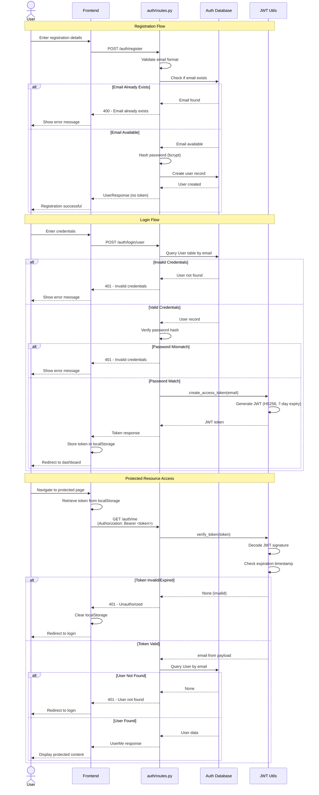


### Admin Excel Upload and Processing

This workflow demonstrates the complete process of uploading an Excel file containing disease pathway data, parsing its complex structure (including merged cells), and storing the hierarchical data in the relational database. The system uses an incremental update strategy to handle both new and updated data efficiently.

#### Key Features:

- Admin-Only Access: Endpoint protected with require_admin dependency
- Excel Parsing: Handles merged cells for stages, extracts pain points and solutions
- Incremental Updates: Smart diff algorithm updates only changed data
- Data Hierarchy: Disease → Stages → Pain Points → Solutions
- Cache Invalidation: Updates disease.updated_at to invalidate CSV cache
- Automatic Cleanup: Deletes temporary uploaded file after processing

Excel Structure Expected:
- Column A: Stage names (merged cells spanning multiple rows)
- Column B: Stage overview (merged cells)
- Column C: Stakeholders (merged cells, comma-separated)
- Column D: Pain point descriptions
- Columns E-I: Five solution types (Digitalization, Automation, Sensing, Clinical Innovation, Process Innovation)
- Column J: SHS Portfolio Coverage
- Column K: Existing Ecosystem Solutions
Column L: Sources/References
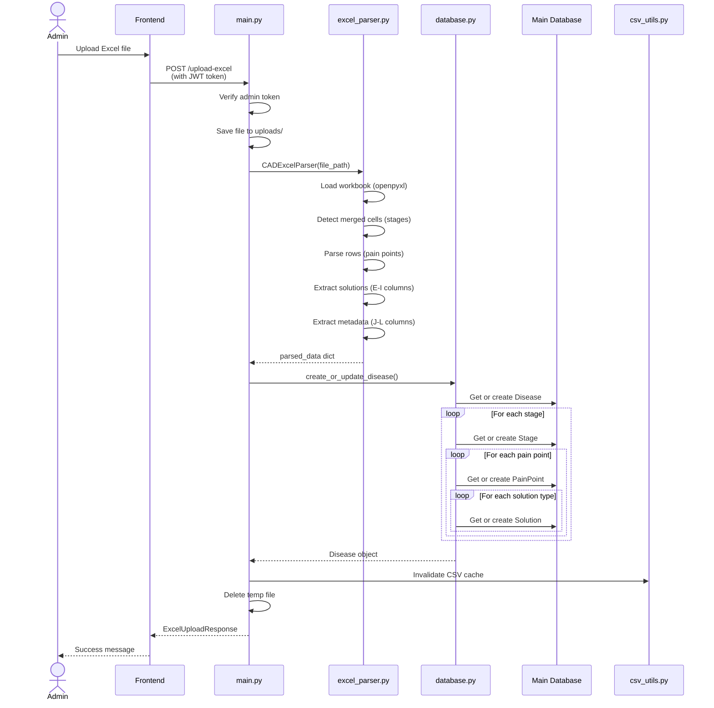

### 3. User Pain Point Submission
This workflow enables authenticated users to submit custom pain points for any disease, which are then queued for administrative review. The system sends real-time notifications to Microsoft Teams using Power Automate webhooks with formatted Adaptive Cards.
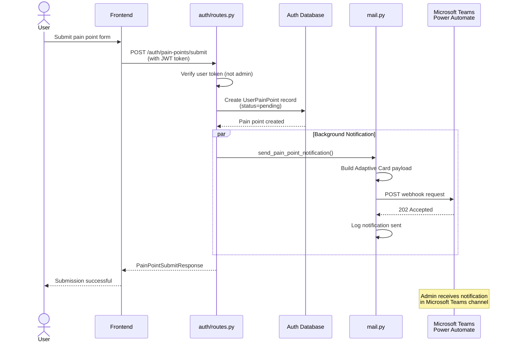

### 4. Admin Pain Point Review and Approval
This workflow enables administrators to view, filter, and moderate user-submitted pain points through a paginated dashboard interface. Admins can approve or deny submissions, which updates the status and reflects in the user's submission history.
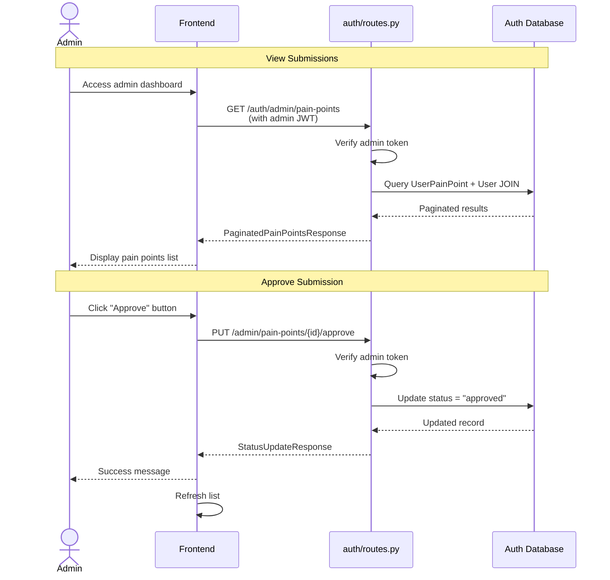

### 5. CSV Download with Caching

This workflow implements a sophisticated caching mechanism for CSV file generation, significantly improving performance for large datasets. The system uses timestamp-based cache invalidation to ensure data freshness while minimizing regeneration overhead.

#### Key Features:

- Smart Caching: Cache validated against disease.updated_at timestamp
- Automatic Invalidation: Any Excel upload invalidates relevant cache
- File Size Limit: 50MB maximum to prevent memory issues
- Automatic Cleanup: Keeps only 3 latest CSV files per disease
- Streaming Response: Large files streamed to prevent timeout
- Full Data Export: Bypasses UI pagination limits for complete dataset

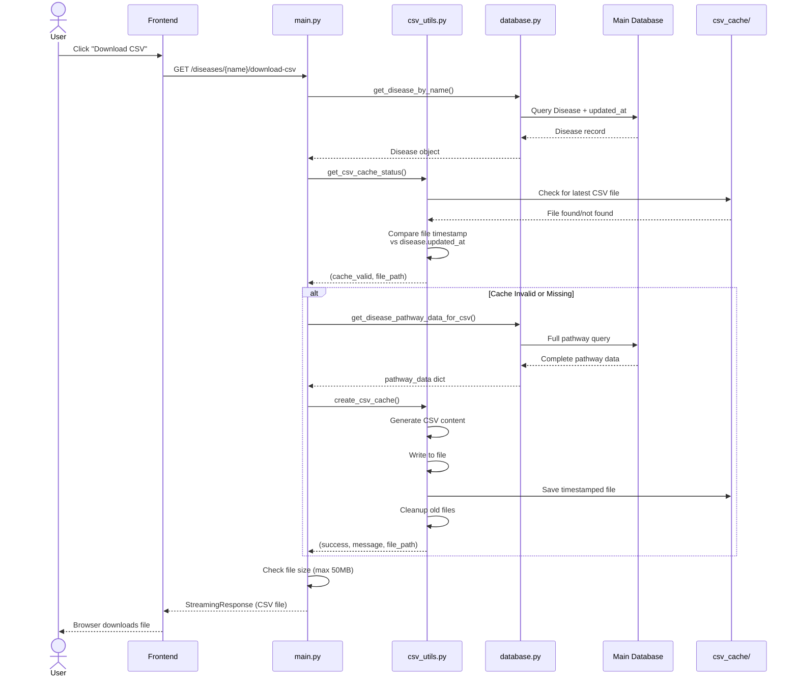
## Admin User Creation Guide
This section provides comprehensive instructions for creating and managing administrative users in the Disease Pathway system.

#### Overview
Admin users have elevated privileges including:
- Upload and manage disease pathway Excel files
- Review and moderate user-submitted pain points
- Manage contact form submissions
- Delete diseases and associated data
- Access admin dashboard and analytics

#### Security Note: </br>
Admin credentials are stored in a separate Admin table with bcrypt-hashed passwords, isolated from regular users for enhanced security.

### Method: Bulk Creation via JSON File (Recommended)
This method allows creating multiple admin users at once using a configuration file.

- Step 1: Create Admin Configuration File
Create a file named admins.json in the project root directory:
    ```bash
    # Navigate to project root
    cd "Disease Pathway"

    # Create admins.json file
    touch admins.json  # Linux/Mac
    # OR
    type nul > admins.json  # Windows
    ```
- Step 2: Add Admin Details to JSON
Open admins.json and add admin user information:
    ```json
    {
    "admins": [
        {
        "email": "admin@example.com",
        "full_name": "John Doe",
        "password": "SecurePassword123!"
        },
        {
        "email": "superadmin@example.com",
        "full_name": "Jane Smith",
        "password": "AnotherSecurePass456!"
        }
    ]
    }
    ```
- Step 3: Run the Admin Creation Script
Execute the script to create admin users:

    ```bash
    # Ensure you're in the project root directory
    python create_admin.py
    ```

# Frontend Overview

The Disease Pathway frontend is a modern, performance-optimized React application built with Vite for lightning-fast development and production builds. The application provides an interface for exploring disease pathways, submitting user feedback, and managing administrative tasks. It implements a component-based architecture with custom styling and smooth animations to deliver an engaging user experience.

The frontend follows a component-based architecture with clear separation between pages, reusable components, utilities, and hooks. The application uses React Router for navigation, Context-free authentication via custom hooks, and a centralized API client for all backend communication.

### **1. Application Architecture**

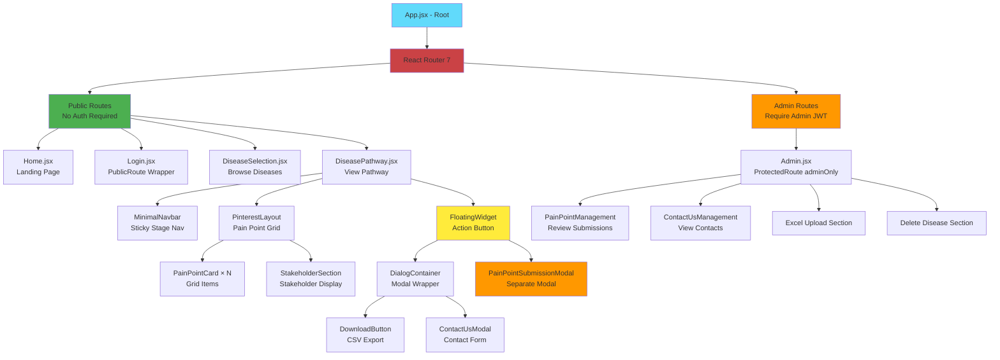

## Frontend Utilities Architecture

The frontend implements a centralized utilities layer that handles API communication, theming, and configuration management. This architecture promotes code reusability, maintainable styling, and consistent API interactions across all components.

### 1. API Client (api.js)
The API client serves as the single source of truth for all backend communication, implementing a centralized axios instance with automatic authentication, error handling, and request/response interceptors.

**Purpose** :
- Centralized HTTP client configuration
- Automatic JWT token injection
- Global error handling and token expiration management
- Organized API endpoint namespaces
- Type-safe response handling


### 2. Constants & Configuration (constants.js)
The constants file centralizes all application-wide configuration, theme colors, and magic numbers to ensure consistency and maintainability.

**Purpose**:
-Single source of truth for styling
- Prevents hardcoded values scattered across components
- Enables easy theme changes
- Type-safe configuration access


## Getting Started: Running the Application
This section provides step-by-step instructions for setting up and running both the backend (FastAPI) and frontend (React) components of the Disease Pathway application.

#### Prerequisites
Before running the application, ensure you have the following installed:

System Requirements
- Python	3.13+	Backend runtime
- Node.js	18.x or 20.x	Frontend build tool
- npm	9.x+	Frontend package manager
- SQL Server	2019+ or Azure SQL	Database server
- ODBC Driver	17 or 18	SQL Server connectivity

**Backend Setup (FastAPI)**

```bash
cd "Disease Pathway"
# Create virtual environment
python -m venv .venv

# Activate virtual environment
# Windows (PowerShell):
.venv\Scripts\Activate.ps1

# Windows (Command Prompt):
.venv\Scripts\activate.bat
# Install all required packages
pip install -r requirements.txt

uvicorn main:app --reload (runs on port 8000)

```

**Frontend Setup (React + Vite)**

```bash
# From project root, navigate to frontend
cd frontend/disease-pathways
npm install
npm run dev
```
</details>
